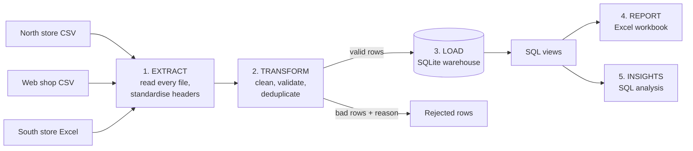

# Sales Data ETL Pipeline: from messy exports to a trusted report

An end-to-end **ETL pipeline** (Extract, Transform, Load, Report) that turns
inconsistent sales exports from several systems into one clean SQL database,
an Excel management report, and answers to business questions.

> **Sample data.** All records are synthetic, generated by
> `generate_messy_data.py` to reproduce the kinds of problems real exports have.


## The business problem

A retailer sells through two physical stores and a web shop. Each system
exports its own file, in its own format. Every month someone merges them by
hand in Excel, and the numbers can't be trusted:

- The same column has three different names in three files
- Dates arrive as `05/03/2026`, `2026-03-05` and `Mar 5, 2026`
- Prices come as `$1,299.00`, discounts as `10%`, `10` or `0.10`
- The same product is written five ways (`USB-C Cable`, `usb c cable`, ` USB-C Cable `)
- Duplicate rows inflate revenue; blank prices and negative quantities slip in
- Nobody can say which rows were dropped or why

**Result:** hours of manual work each month, and management decisions made on
numbers nobody can fully verify.


## The solution

One command runs the whole pipeline:

```bash
python run_pipeline.py
```



| Step | What happens | Code |
|---|---|---|
| **1. Extract** | Reads every CSV/Excel file in `data/raw/`; maps each source's column names to one schema | `etl/extract.py` |
| **2. Transform** | Parses dates, prices, discounts, quantities; standardises product and channel names; trims whitespace; removes duplicates; **quarantines unusable rows with a reason** instead of silently dropping them | `etl/transform.py` |
| **3. Load** | Writes clean data to a SQLite warehouse with constraints, reporting views and an audit log; verifies the database matches the transform output | `etl/load.py`, `sql/schema.sql` |
| **4. Report** | Builds an Excel workbook whose numbers are **live formulas** over the clean data | `etl/report.py` |
| **5. Insights** | Answers business questions in SQL (growth, concentration, customer loyalty) | `sql/analysis_queries.sql` |

## What the business gets

**A report they can trust.** 1,337 raw rows in, 1,272 clean rows out, and every
row accounted for:


**Nothing disappears silently.** The 37 duplicates and 28 unusable rows are
counted, and the unusable ones are listed with the reason (missing price, zero
quantity, unreadable date) so someone can fix them at the source.


**Answers, not just tables.** `output/insights.md` is generated from SQL.
Examples from the sample data:

- Three products (Ergonomic Chair, 27-inch Monitor, Noise-Cancelling
  Headphones) generate **56% of revenue**; the bottom four generate under 8%.
- In-store sales are **60% of revenue**, and the top three products are the
  same in both channels.
- Monthly revenue moves by up to ±17%, which the month-over-month growth query surfaces.

*(The data is random, so these are illustrations of the analysis, not real findings.)*

## Design decisions worth noting

- **Nothing silently dropped.** Every input row ends up loaded, removed as a
  duplicate, or rejected with a reason, and the pipeline **fails loudly** if
  `received != loaded + duplicates + rejected`.
- **Exact money arithmetic.** Revenue is computed with `Decimal` and rounded
  half-up per line, not with floats. An early float-based version was about
  30 cents off in total; a cross-check against the Excel report caught it. The
  SQL warehouse and the Excel report now agree to the cent.
- **Idempotent load.** Re-running the pipeline refreshes the data rather than
  double-counting; a separate `pipeline_runs` table keeps an audit trail.
- **Rules live in one file.** New column names, products, channels or date
  formats are added in `etl/rules.py`. The transform logic doesn't change when
  a new source appears.
- **Database constraints as a second safety net.** `CHECK` constraints reject
  a zero quantity or negative price even if cleaning missed it.
- **Explicit assumption:** slash dates like `05/03/2026` are treated as
  day-first. Ambiguous or unreadable dates are rejected, never guessed.

## Run it yourself

```bash
pip install -r requirements.txt
python generate_messy_data.py     # optional: regenerate the sample raw files
python run_pipeline.py            # E -> T -> L -> report -> insights
python -m pytest tests -q         # 9 tests
```

Outputs: `output/Sales_Report.xlsx`, `output/insights.md`, and the SQLite
warehouse `output/sales_warehouse.db` (open it in DBeaver or any SQLite viewer).

## Project structure

```
run_pipeline.py            orchestrates the five steps
generate_messy_data.py     builds realistic messy sample files
etl/
  rules.py                 column maps, product list, channels, date formats
  extract.py  transform.py  load.py  report.py  insights.py
sql/
  schema.sql               tables, constraints, indexes, reporting views
  analysis_queries.sql     business questions (CTEs, window functions)
data/raw/                  the three messy source files
output/                    Excel report and insights
tests/test_pipeline.py     parsers + end-to-end integrity checks
```

## Tech

Python (pandas, openpyxl), SQL (SQLite: CTEs, window functions, views,
constraints), Excel (formulas, charts), pytest.

## Need something like this?

I build data cleaning, ETL and reporting automation around the systems a
business already uses: CSV/Excel exports, databases, or APIs, with the output
in Excel, SQL or a BI dashboard.

Muhammad Adnan · [LinkedIn](https://linkedin.com/in/muhammad-adnan-740336293)
· adnandanish0404@gmail.com

See also: [dropship-reconciliation-engine](https://github.com/Adnan040404/dropship-reconciliation-engine)
· [payout-reconciliation-excel-report](https://github.com/Adnan040404/payout-reconciliation-excel-report)

