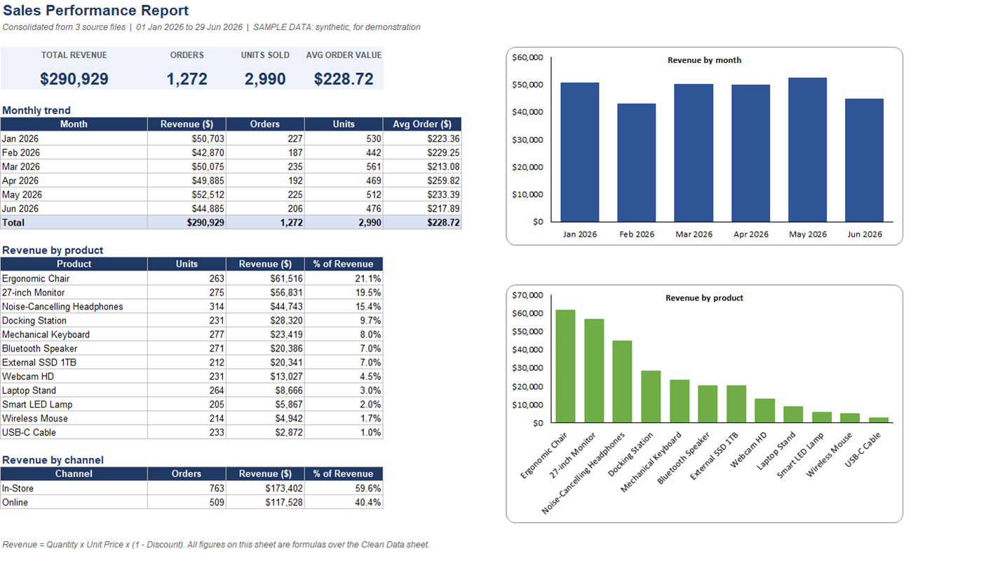
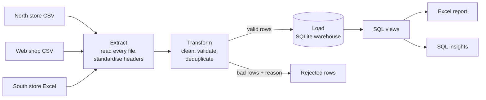
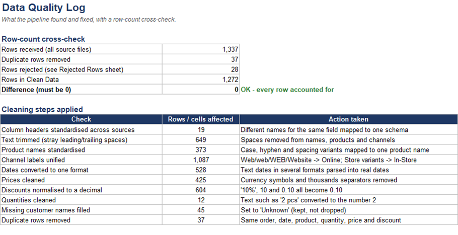
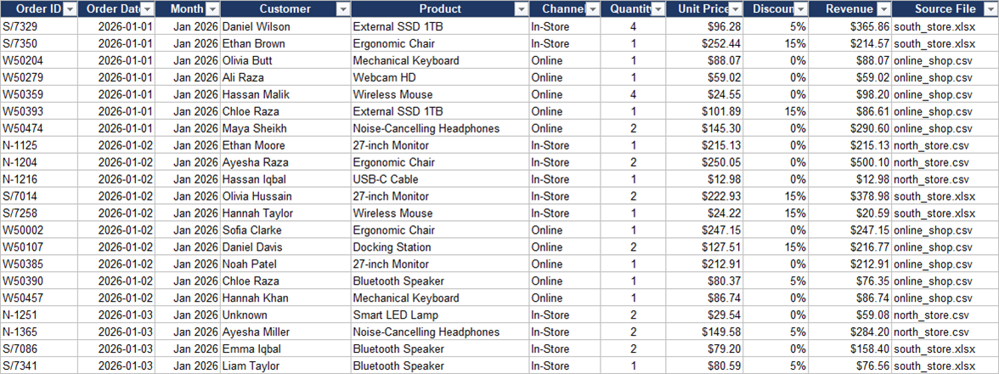

# Sales Data ETL Pipeline


This project takes messy sales exports from three different systems and turns
them into one clean database, an Excel report, and a few answers to business
questions. It runs from a single command.

All data is synthetic. `generate_messy_data.py` creates files with the kinds of
problems real exports have, so the pipeline has something realistic to clean.



## The situation

Picture a retailer with two physical stores and a web shop. Each one exports its
own file in its own format, and once a month someone merges them by hand in
Excel. The numbers can't really be trusted, because:

- the same field has a different column name in each file
- dates show up as `05/03/2026`, `2026-03-05` and `Mar 5, 2026`
- prices look like `$1,299.00`, and discounts like `10%`, `10` or `0.10`
- one product is typed many ways (`USB-C Cable`, `usb c cable`, a trailing space)
- there are duplicate rows, blank prices and negative quantities
- nobody can say which rows were dropped, or why

Here is one of the raw files as it opens in Excel:


## How the pipeline works



| Step | What it does | Where |
|---|---|---|
| Extract | Reads every CSV and Excel file in `data/raw/` and maps each source's column names to one schema | `etl/extract.py` |
| Transform | Parses dates, prices, discounts and quantities, standardises product and channel names, trims spaces, removes duplicates, and sets aside unusable rows with a reason | `etl/transform.py` |
| Load | Writes the clean rows to a SQLite database with constraints, reporting views and a run log, then checks the database matches what the transform produced | `etl/load.py`, `sql/schema.sql` |
| Report | Builds the Excel workbook. The numbers are live formulas over the clean data | `etl/report.py` |
| Insights | Runs SQL for the business questions (growth, product concentration, customer loyalty) and writes `output/insights.md` | `sql/analysis_queries.sql` |

## What comes out

1,337 raw rows go in and 1,272 clean rows come out. The rest is accounted for:
37 duplicates were removed and 28 rows were unusable (missing price, zero
quantity, unreadable date). The Excel report has a sheet that lists each fix and
a check that the row counts add up.



The 28 rejected rows aren't thrown away. They're listed with the reason so
somebody can correct them at the source.



`output/insights.md` is generated from SQL. A few things it shows on this sample
data: the top three products make up about 56% of revenue, in-store is about 60%
of sales, and monthly revenue moves between roughly -15% and +17%. The data is
random, so read those as examples of the analysis and not as real findings.

## Decisions worth mentioning

- **Nothing disappears quietly.** Every input row ends up loaded, removed as a
  duplicate, or rejected with a reason. The pipeline stops with an error if
  received rows don't equal loaded + duplicates + rejected.
- **Money uses exact decimals.** My first version used floats and the total was
  about 30 cents off compared with the Excel report. Comparing the two caught it.
  Revenue is now calculated with `Decimal` and rounded half-up per line, and the
  database and the report agree to the cent.
- **The load can be re-run.** It refreshes the data instead of adding to it, so
  running it twice doesn't double the revenue. A separate `pipeline_runs` table
  keeps a history.
- **Cleaning rules live in one file.** New column names, products, channels or
  date formats go in `etl/rules.py`. Adding a source doesn't mean touching the
  transform code.
- **The database checks too.** `CHECK` constraints would refuse a zero quantity
  or a negative price even if the cleaning missed it.
- **A source it can't read stops the run.** If a file's columns aren't recognised (a renamed header, or a CSV whose first header carries Excel's invisible byte-order mark), the pipeline stops with a message that lists the columns it found and where to add the new name. Without that check, every row would quietly land in the rejects.
- **One assumption to know about:** dates with slashes, like `05/03/2026`, are
  read as day/month/year. Dates that can't be read are rejected, not guessed.

## Running it

```bash
pip install -r requirements.txt
python generate_messy_data.py    # optional: rebuild the sample raw files
python run_pipeline.py           # extract, transform, load, report, insights
python -m pytest tests -q        # 14 tests
python run_pipeline.py --raw-dir path\to\your\exports   # your own files
```

You get `output/Sales_Report.xlsx`, `output/insights.md` and a SQLite database at
`output/sales_warehouse.db`, which opens in DBeaver or any SQLite viewer.

## Layout

```
run_pipeline.py            runs the five steps
generate_messy_data.py     builds the sample raw files
etl/
  rules.py                 column names, product list, channels, date formats
  extract.py  transform.py  load.py  report.py  insights.py
sql/
  schema.sql               tables, constraints, indexes, views
  analysis_queries.sql     the business questions
data/raw/                  the three source files
output/                    Excel report and insights
tests/test_pipeline.py     parser tests and end-to-end checks
```

Built with Python (pandas, openpyxl), SQL (SQLite), Excel and pytest.

## Contact

Muhammad Adnan, [LinkedIn](https://linkedin.com/in/muhammad-adnan-740336293),
adnandanish0404@gmail.com

Related: [dropship-reconciliation-engine](https://github.com/Adnan040404/dropship-reconciliation-engine),
[payout-reconciliation-excel-report](https://github.com/Adnan040404/payout-reconciliation-excel-report)
